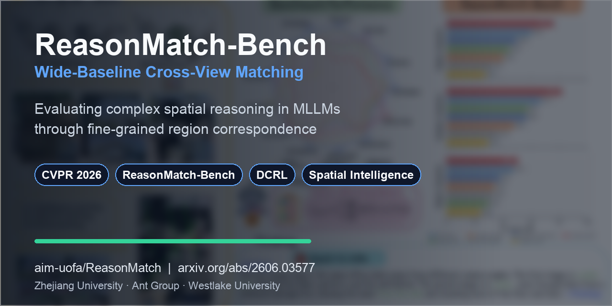

# ReasonMatch-Bench

<p align="center">
  
</p>

ReasonMatch-Bench is a benchmark and training recipe for evaluating visual reasoning over point correspondences. The repository contains:

- A ReasonMatch-Bench evaluation suite for in-domain visual matching tasks.
- An out-of-domain rebuttal evaluation suite.
- A veRL-based reinforcement learning training recipe for multimodal models.
- Public dataset download instructions through Hugging Face and ModelScope.

The codebase vendors veRL under `verl/`. Project-specific code lives under `my_recipe/`, and benchmark/evaluation code lives under `evaluate/`.

`pip install -e .` installs a package named `verl`. Use a fresh virtual environment so it does not collide with an upstream `verl` install.

## Paper

**Eliciting Complex Spatial Reasoning in MLLMs through Wide-Baseline Matching** · CVPR 2026

Hao Zhong\*, Muzhi Zhu\*, Shenyan Zeng\*, Anzhou Li, Cong Chen, Hua Geng, Duochao Shi, Wentao Ye, Tao Lin†, Hao Chen†, Chunhua Shen†  
(\* equal contribution · † corresponding author)  
Zhejiang University · Ant Group · Westlake University

- **Project page:** [https://aim-uofa.github.io/reasonmatch/](https://aim-uofa.github.io/reasonmatch/)
- **arXiv:** [https://arxiv.org/abs/2606.03577](https://arxiv.org/abs/2606.03577)
- **Dataset:** [`ReasonMatch/ReasonMatch`](https://huggingface.co/datasets/ReasonMatch/ReasonMatch) on Hugging Face
- **Dataset mirror:** [`jxzh2020/ReasonMatchBench`](https://www.modelscope.cn/datasets/jxzh2020/ReasonMatchBench) on ModelScope
- **Pretrained weights:** to be announced

Wide-baseline matching (WBM) requires integrating geometric understanding, viewpoint changes, fine-grained perception, and occlusion reasoning, making it a challenging testbed for spatial reasoning in multimodal large language models (MLLMs). We introduce **ReasonMatch-Bench**, a benchmark stratified by viewpoint displacement and matching granularity, and **Dynamic Correspondence Reinforcement Learning (DCRL)** for verifiable wide-baseline matching training without explicit chain-of-thought supervision.

```bibtex
@InProceedings{Zhong_2026_CVPR,
    author    = {Zhong, Hao and Zhu, Muzhi and Zeng, Shenyan and Li, Anzhou and Chen, Cong and Geng, Hua and Shi, Duochao and Ye, Wentao and Lin, Tao and Chen, Hao and Shen, Chunhua},
    title     = {Eliciting Complex Spatial Reasoning in MLLMs through Wide-Baseline Matching},
    booktitle = {Proceedings of the IEEE/CVF Conference on Computer Vision and Pattern Recognition (CVPR)},
    month     = {June},
    year      = {2026},
    pages     = {16768-16778}
}
```

## Release Scope

This open-source release includes:

- Training and evaluation code for the paper-specific recipe.
- ReasonMatch-Bench archive: `reasonmatch_bench.tar.gz`.
- Out-of-domain evaluation archive: `ood_dataset.tar.gz`.

Training data is **not** included. Training entry points are provided for reproduction reference and for users with their own LMDB-formatted data.

## Repository Layout

```text
evaluate/
  matchbench/        ReasonMatch-Bench evaluation entry points and metric tools
  rebuttal/          Out-of-domain evaluation entry points and helpers
my_recipe/
  buffer/            Dynamic task buffer and matching curriculum utilities
  config/            Hydra configs for training and curriculum scheduling
  mydatasets/        LMDB dataset readers and multi-dataset wrapper
  reward_fn/         Task reward functions
  workers/           Custom veRL workers and trainer integration
  main_dcrl.py       veRL Ray training entry point (Hydra); paper recipe sets GRPO via CLI overrides
scripts/             Local smoke/demo utilities
verl/                Vendored veRL framework code
```

## Environment Setup

Create a fresh Python environment. Python 3.10 or newer is required.

```bash
pip install -e .[vllm]
pip install -r my_recipe/requirements.txt
pip install flash-attn --no-build-isolation
```

Using `uv` is recommended for multi-node Ray training environments:

```bash
uv init
uv pip install -e .[vllm]
uv pip install -r my_recipe/requirements.txt
uv pip install flash-attn --no-build-isolation
source .venv/bin/activate
```

The `vllm` extra follows the pinned version in `setup.py`. If you need to reproduce an older internal environment, install a CUDA-compatible vLLM build explicitly before running training.

## Dataset Preparation

The public evaluation dataset is hosted on Hugging Face at [`ReasonMatch/ReasonMatch`](https://huggingface.co/datasets/ReasonMatch/ReasonMatch). A ModelScope mirror is also available at [`jxzh2020/ReasonMatchBench`](https://www.modelscope.cn/datasets/jxzh2020/ReasonMatchBench).

```bash
dataset_path=/your/absolute/path/to/datasets
dataset_repo=ReasonMatch/ReasonMatch

huggingface-cli download "${dataset_repo}" \
    --repo-type dataset \
    --include 'reasonmatch_bench.tar.gz' 'ood_dataset.tar.gz' \
    --local-dir "${dataset_path}"

tar -xzf "${dataset_path}/reasonmatch_bench.tar.gz" -C "${dataset_path}"
tar -xzf "${dataset_path}/ood_dataset.tar.gz"       -C "${dataset_path}"
```

Alternatively, download from the ModelScope mirror:

```bash
dataset_path=/your/absolute/path/to/datasets
dataset_repo=jxzh2020/ReasonMatchBench

modelscope download --repo-type dataset "${dataset_repo}" \
    --include 'reasonmatch_bench.tar.gz' 'ood_dataset.tar.gz' \
    --local_dir "${dataset_path}"
```

After extraction:

- `reasonmatch_bench/` contains ReasonMatch-Bench, including `annotation_index.json`.
- `ood_dataset/` contains the out-of-domain evaluation set.

Checksums for the published archives:

```text
0dc40381f8ebf39808c6176533c6b0473d2d85583410d27c5ebc5d1c7171934b  reasonmatch_bench.tar.gz
10708d00b0b8dd8775851fe462eea25ada259073d78d36d892967bc2fd2548ca  ood_dataset.tar.gz
```

## Training

Training data is not included in this release. If you use your own data, organize it as LMDB datasets compatible with `my_recipe/mydatasets/anno_raw.py`.

**Algorithm:** DCRL is trained with **GRPO** in veRL (`algorithm.adv_estimator=grpo`). The public launch path is [`my_recipe/main_dcrl.py`](my_recipe/main_dcrl.py) with shell wrappers under `my_recipe/`. Some internal class/config names still inherit upstream veRL `dapo` naming, but this release does **not** use the DAPO advantage estimator or DAPO dynamic sampling.

The paper launch script is [`my_recipe/run_dcrl_anno.sh`](my_recipe/run_dcrl_anno.sh). It invokes `main_dcrl.py` with GRPO settings and GSPO policy-loss knobs used in our experiments. [`my_recipe/run_grpo_anno.sh`](my_recipe/run_grpo_anno.sh) is an alternate launcher with the same GRPO estimator and a smaller default rollout batch. The older `main_dapo.py`, `run_gspo_anno.sh`, and `run_dapo_anno.sh` names are kept only as compatibility aliases.

Training scripts accept either a single dataset directory or a JSON manifest of LMDB dataset paths. Copy the example manifest and replace the placeholder paths:

```bash
cp my_recipe/datasets.example.json my_recipe/datasets.json
```

Set the required environment variables before launching:

```bash
export MODEL_PATH=/abs/path/to/Qwen3-VL-8B-Instruct
export DATASET_PATH=/abs/path/to/my_recipe/datasets.json
export CKPTS_DIR=/abs/path/to/ckpts

bash my_recipe/run_dcrl_anno.sh
```

Common training knobs, including `n_gpus_per_node`, `NNODES`, `train_prompt_bsz`, `gen_tp`, and buffer settings, are defined inside the shell scripts. The checked-in defaults are smoke-test settings, not paper-scale reproduction defaults.

## Evaluation

All evaluation scripts assume the model is served through an OpenAI-compatible API. A local vLLM server is the default setup, but the OpenAI API runner is also supported where noted.

Use the same `dataset_path` from [Dataset Preparation](#dataset-preparation) below.

### ReasonMatch-Bench

```bash
cd evaluate/matchbench
python run_evaluation.py \
    --annotation_index "${dataset_path}/reasonmatch_bench/annotation_index.json" \
    --testset_root    "${dataset_path}/reasonmatch_bench" \
    --output_dir      ./eval_results \
    --model_name      my_model_alias \
    --runner          vllm \
    --model_id        auto \
    --base_url        http://localhost:8000/v1 \
    --api_key         EMPTY \
    --concurrency     32
```

Useful options:

- `--runner openai` uses the official OpenAI API and requires `OPENAI_API_KEY`.
- `--runner vllm --model_id auto` resolves the served model name from `${base_url}/models`.
- `--dataset_filter`, `--stage_filter`, and `--max_samples` narrow the evaluation set.
- `--no_think` disables thinking-mode prompt formatting.

After evaluation, use:

```bash
python report_metrics.py
python rebuild_summary.py
python viz_results.py
```

### Out-of-Domain Rebuttal Evaluation

```bash
cd evaluate/rebuttal
export TESTSET_ROOT="${dataset_path}/ood_dataset"
export VLLM_BASE_URL=http://localhost:8000/v1
bash eval.sh my_model_alias
```

For custom runners or decoding settings, call `python run_eval.py ...` directly. Label-count utilities are available through `label_cnt.sh` and `chk_label_cnt.py`.

## Development Notes

- Avoid editing `verl/` unless the change is intentionally upstream-compatible. Local project extensions should live in `my_recipe/`.
- Evaluation code is intentionally separate from training code and lives under `evaluate/`.
- Generated outputs such as checkpoints, `eval_results/`, TensorBoard logs, and local CodeGraph indexes are ignored by Git.

## Acknowledgements

The training code is built on top of the vendored [veRL](https://github.com/volcengine/verl) framework under `verl/`. The root `LICENSE` and `Notice.txt` files preserve veRL's Apache-2.0 license and notice information for that vendored training framework.

## License

The vendored veRL code is distributed under the Apache License 2.0. See `LICENSE` and `Notice.txt` for the upstream veRL license and notice text.
